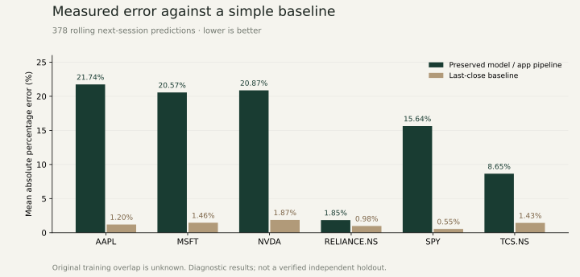

# Northstar / AI-Powered Market Navigator

**Built and maintained by [Aditya Gholap · NoirPrimordial7](https://github.com/NoirPrimordial7).** An independent stock research studio with prices, technical indicators, risk measures, experimental model inference, historical scenarios and publisher-linked news.


**[Open the live research studio ↗](https://northstar-aditya-gholap.streamlit.app/)** · Hosted on Streamlit Community Cloud.

## Project documentation

- [Model architecture, verified metadata and training recipe](docs/MODEL_CARD.md)
- [Evaluation method and complete results](docs/EVALUATION.md)
- [Data provenance and usage terms](docs/DATA_CARD.md)
- [Recovered academic project evidence](docs/RECOVERY.md)
- [Deployment and request limits](docs/DEPLOYMENT.md)
- [Copyright and attribution](NOTICE.md)
- [All 378 diagnostic predictions](evaluation/predictions.csv) · [metrics and input hashes](evaluation/metrics.json)

## What visitors can try

**Overview:** an editorial Northstar introduction, six saved market histories, real price charts, stock sparklines and topical publisher headlines.

**Research studio:** saved studies, live Yahoo Finance histories or a validated OHLCV CSV; prices/candlesticks; SMA 20/50 and Bollinger overlays; volume; window return, volatility and drawdown; RSI/MACD; explicitly loaded stock headlines; CSV export and model details. Compact working headers, collapsible controls and view tabs bring the selected content into sight.

**Scenarios:** 400 deterministic historical-return simulations over 5–60 business sessions. Simulations are separate from the model; the percentile band is not validated forecast confidence.

**Watchlist:** up to eight tickers, add/remove controls, bookmarkable lists, market filters, requested model comparisons, shared-date performance indexed to 100 and daily-return correlations. Comparison has its own direct view instead of sitting below the stock table. Phone layouts, keyboard focus and reduced-motion preferences are supported.

## Measured model performance

The supplied `model3.h5` is preserved byte-for-byte. Its input is **30 sessions × 11 features**; its recurrent architecture combines bidirectional LSTM, GRU and LSTM. Saved compile metadata records Adam and MSE.

The current app pipeline was evaluated on **378 rolling next-session targets**, 63 per saved symbol. Mean per-symbol absolute percentage error was **14.89% for the model**, versus **1.25% for a last-close/persistence baseline**. The model underperformed the baseline on every symbol.

Original training overlap is unknown. These are **pipeline diagnostic results, not verified independent holdout scores**. MAPE is an error measure, not classification accuracy; `100 − MAPE` is not an accuracy score. No invented confidence or accuracy is displayed.

On 376 non-flat moves, **direction accuracy was 51.60%**, compared with **50.27% for always predicting up** and **48.94% for repeating the last daily return**. Only **21.96%** of model price estimates were within 5% of the actual next close, versus **98.68%** for the last-close baseline. These diagnostics do not reproduce the old **81% accuracy** claim or establish useful predictive skill.

All **1,506 saved OHLCV observations** passed structural checks. A fresh Yahoo download matched dates and volumes exactly; tiny price differences under 0.00026 quote units are recorded in [the source audit](evaluation/data-audit.json). This checks consistency with the same provider, not independent exchange accuracy. Reproduce with `python audit_data.py`.



The original notebook, training dataset, exact symbols/dates/splits, epoch log and scaler were not recovered in targeted local-drive and accessible Google Drive searches. Recovered academic reports discuss the project but do not establish an executed model3 training run. Current saved histories are release demonstration/evaluation data, **not original training data**.

[`training.py`](training.py) supplies a **new reproducible recipe** with fresh weights, chronological 70/15/15 partitions, training-only scaling and next-session targets. It never replaces the original model. A successful one-epoch training/export smoke run is recorded in [training-smoke.json](docs/training-smoke.json); it is not a tuned replacement or original training history.

## Run locally

Use **Python 3.12**:

```sh
python -m venv .venv
# Windows: .venv\Scripts\activate
# macOS/Linux: source .venv/bin/activate
python -m pip install -r requirements.txt
python -m streamlit run app.py
```

The primary app needs no API keys. Optional NewsAPI/Reddit sentiment uses fresh environment variables or Streamlit Secrets; `.streamlit/secrets.example.toml` contains placeholders. Uploaded CSVs need Date, Open, High, Low, Close and Volume; at least 60 daily rows; unique dates; finite positive prices; nonnegative volume; consistent OHLC ranges; and at most 5 MB. Choose the upload currency explicitly.

## Test, evaluate and train

```sh
python -m pip check
python -m unittest discover -s tests -v
python evaluate.py
python training.py --csv data/AAPL.csv --output training-runs/aapl-v1 --epochs 100
```

**23 local checks pass:** actual model inference, page rendering, submitted/query-linked studies, invalid inputs, source/date handling, request bounds, news relevance/outages, scenario reproducibility, risk mathematics, shared-date comparisons, watchlist isolation, known evaluation errors and training-scaler leakage prevention. GitHub Actions runs these on Linux/Python 3.12 and verifies the original model hash. Cloud CI status must be checked separately from local results.

Evaluation writes target-level predictions, metrics and model/input hashes. Each prediction's preprocessing sees only its observed history. Training exports a separate model, JSON scaler, learning curves, ranges, counts and test predictions to a **new** output directory. Existing artifacts are never overwritten. `prepare_data.py` manually refreshes examples and provenance; rerun evaluation when inputs change. Vendor revisions and numerical kernels can change reproduced values.

## Sources and demo limits

Saved histories come from Yahoo Finance via yfinance; collection dates are in [provenance.json](data/provenance.json). Provider content retains its own rights and terms. News uses CNBC Finance RSS, Federal Reserve releases and ticker-specific Yahoo Finance RSS. Complete articles are not copied. News dates are independent of study dates. Headlines, sentiment and scenarios do not enter the saved model; event tags do not establish a causal price impact.

Explicit analysis/news/sentiment/watchlist actions are limited to **5 per minute per session** and **120 per hour across this instance**. A watchlist action handles at most eight symbols. Histories/inference/news cache for 15 minutes; sentiment for 30 minutes. There are no paid LLM calls or visitor-triggered training jobs. Session identities can reset and ephemeral hosting can reset counters; this is an interview demo, not distributed abuse protection.

Old public source contained hardcoded credentials. This release excludes them, but owners must revoke the old keys with their providers: changing current files does not remove keys from Git history. Never commit actual secrets, environments, caches or private academic documents.

## Copyright and project history

© 2026 **Aditya Gholap · NoirPrimordial7**, for his contributions. No open-source license has been selected. Provider content and dependencies retain their respective rights. The academic project credits Ashwin Gudur, Arya Dhumal, Himank Maheshwari and Aditya Gholap under Prof. Pratik Kamble; that attribution is preserved in [NOTICE](NOTICE.md).

The release combines the earlier Northstar research tools with an original editorial design inspired by the reviewed Awwwards monthly/yearly examples. Local E-drive/F-drive originals and model copies are preserved. Private administrative documents, signatures, student identifiers, email addresses and unrelated Drive files are excluded.
